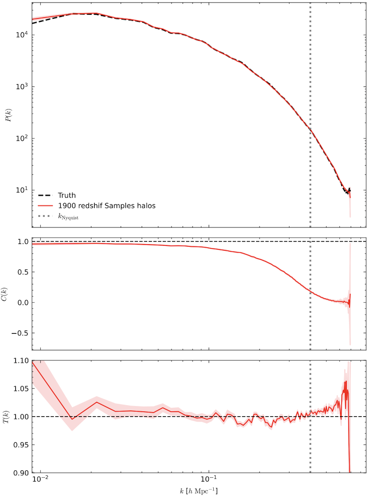

# IC_pixel-diffusion: Pixel-based Diffusion Model for Reconstructing Cosmological Initial Conditions

This project investigates the **ability of diffusion models to reconstruct cosmological initial conditions (ICs)** under different scenarios.  
We evaluate the model’s performance in the presence of **noisy observations** (halo fields), **varying numbers of training samples**, and by **adding additional observational information**, in order to study its robustness and reconstruction quality.

  

## Overview

The core architecture of this project is based on **“Posterior Sampling of the Initial Conditions of the Universe from Non-Linear Large-Scale Structures Using Score-Based Generative Models”**([arXiv:2304.03788](https://arxiv.org/abs/2304.03788)).
1. We first generate datasets from the Quijote Latin Hypercube simulations for both z = 127 (initial conditions) and z = 0 (dark-matter and halo fields).  
2. We then apply a pixel-based diffusion model to these observational datasets to evaluate reconstruction performance under different conditions. 
3. Finally, we assess the model’s accuracy using three key metrics: Power Spectrum, Cross-Correlation Coefficient, and Transfer Function.

## Dataset Preparation

<b>Details</b>

The dataset used for this project is based on the **Quijote simulation suite**, which provides large-scale N-body simulations of the Universe.  
These simulations are used here to generate both the initial condition density fields (z = 127) and the observational fields — including dark matter** and **halo density fields (z = 0).

You can access all Quijote simulation datasets through their official website:[https://quijote-simulations.readthedocs.io](https://quijote-simulations.readthedocs.io/en/latest/index.html#). After downloading the simulation data, use the generation scripts provided in this repository to produce the voxelized datasets.

- The **initial condition (z = 127)** density fields are generated using the Latin Hypercube simulation snapshots from Quijote. [Initial Condition Generation Code](https://github.com/UVA-MLSys/IC_pixel-diffusion/blob/main/Dataset/generate_train_z127_density.py)

- The **dark matter density fields (z = 0)** are generated from the same Latin Hypercube snapshots.[Dark Matter Density Field Code](https://github.com/UVA-MLSys/IC_pixel-diffusion/blob/main/Dataset/generate_train_z0_density.py)

- The **halo density fields (z = 0)** are constructed from halo catalogs produced by the Friends-of-Friends (FoF) algorithm applied to the Quijote N-body simulations.[Halo Field Generation Code](https://github.com/UVA-MLSys/IC_pixel diffusion/blob/main/Dataset/generate_halo_redshift_mass.py)

After generating the individual samples for both redshifts (z = 127 and z = 0), use the **stacking script** in the `Dataset/` folder to combine all simulation IDs into single large `.npy` arrays for training.

Depending on your training setup, you can select how many samples to use based on simulation ID. and split dataset between training and testing sampling based on Sim IDs. 

For demonstration purposes, three small stacked dataset samples are included in the `Dataset/` folder:

- `quijote128_halo_train_3.npy` — stacked sample of **z = 0 halo density fields** (3 simulations)  
- `quijote128_dm_train_3.npy` — stacked sample of **z = 0 dark matter density fields** (3 simulations)  
- `quijote128_z127_train_3.npy` — stacked sample of **z = 127 initial condition fields** (3 simulations)

These example files allow users to verify the dataset format and test the training and sampling scripts without downloading the full dataset.

The **complete datasets** (2000 generated samples for each redshift) are available on Google Drive:
- [Full Halo z = 0 Dataset](https://drive.google.com/drive/folders/1q6G-_9AL3xSll_kI4hf-qtSbotvebPuy?usp=drive_link)  
- [Full Dark Matter z = 0 Dataset](https://drive.google.com/drive/folders/1q6G-_9AL3xSll_kI4hf-qtSbotvebPuy?usp=drive_link)  
- [Full z = 127 Dataset](https://drive.google.com/drive/folders/1q6G-_9AL3xSll_kI4hf-qtSbotvebPuy?usp=drive_link)

## Model Training

<b> Details </b>

The stacked datasets of both redshifts (**z = 0** halo fields and **z = 127** initial condition fields)
are fed into the conditional diffusion model to begin training.  
A total of **1900 samples** are used for training for each redshift. 
The corresponding training script is provided here: [train code](https://github.com/UVA-MLSys/IC_pixel-diffusion/blob/main/train.py)
Training is performed on **4 NVIDIA A100 GPUs** available on the **UVA Rivanna** supercomputing cluster,
using a **batch size of 4 per GPU** (effective total batch size of 16) for **400 epochs**.  
The complete training process takes approximately **17 hours**.

All key hyperparameters, such as the number of epochs, batch size, learning rate, and model configuration,
can be modified in the corresponding [config file](https://github.com/UVA-MLSys/IC_pixel-diffusion/blob/main/config.json) to suit different datasets or experiments.

## Sampling and Evaluation

 

<b> Details</b>

After training, the model enters the **sampling phase**, where it generates reconstructed
initial conditions from unseen test data. During sampling, the model receives the **observed z = 0 halo field**
as input and progressively denoises it to reconstruct the corresponding **z = 127 initial condition field**.

The sampling process is handled by the following script:
[`sample.py`](https://github.com/UVA-MLSys/IC_pixel-diffusion/blob/main/sample.py)

The **number of generated samples** can be adjusted as a hyperparameter in the configuration file, allowing flexibility in testing on different dataset sizes.

Once the samples are generated, they are combined into a single file using the stacking script:
[`combine_samples.py`](https://github.com/UVA-MLSys/IC_pixel-diffusion/blob/main/Combine_sample.py)

This combined sample file is then used to evaluate the model’s reconstruction performance.
The evaluation is performed using:
[`result.py`](https://github.com/UVA-MLSys/IC_pixel-diffusion/blob/main/results.py)

The evaluation script computes three key metrics to assess reconstruction quality:
- **Power Spectrum** — measures the statistical similarity of large-scale modes.  
- **Cross-Correlation Coefficient** — quantifies the correlation between predicted and true fields.  
- **Transfer Function** — evaluates the scale-dependent amplitude accuracy.

The figure below shows the evaluation results for the model trained on **1900 samples** and
**conditioned on the halo density field**.  
It presents the three key metrics—**Power Spectrum**, **Cross-Correlation**, and
**Transfer Function**—used to assess the reconstruction performance of the model.

  

