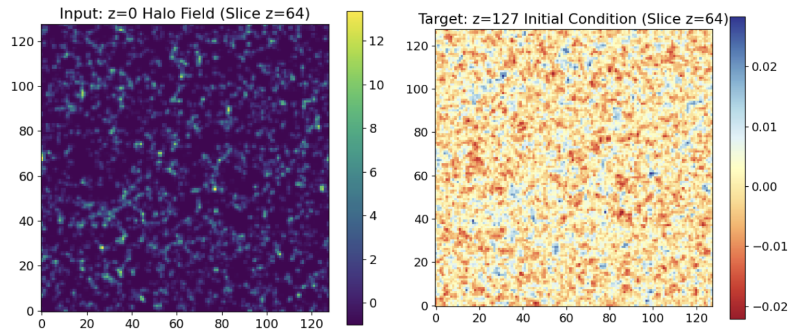
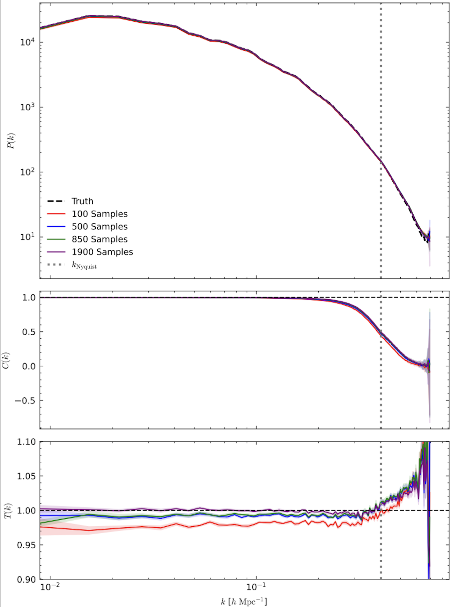
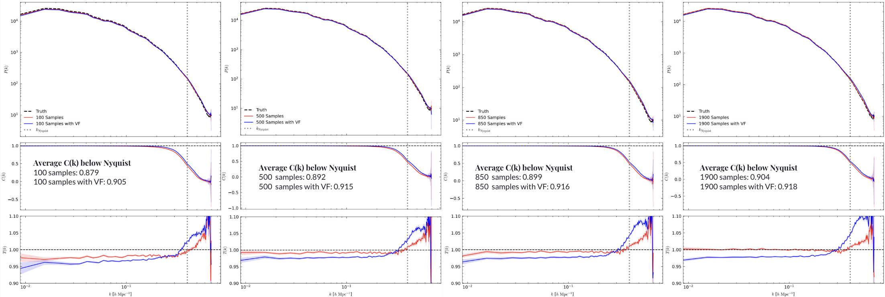
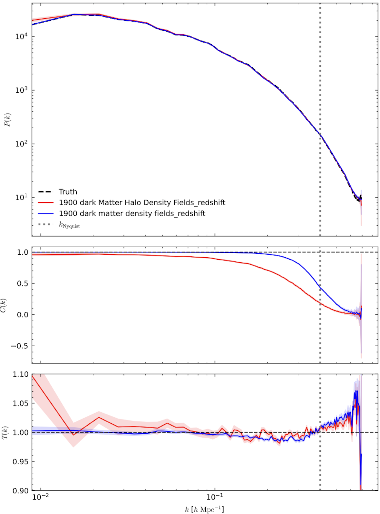
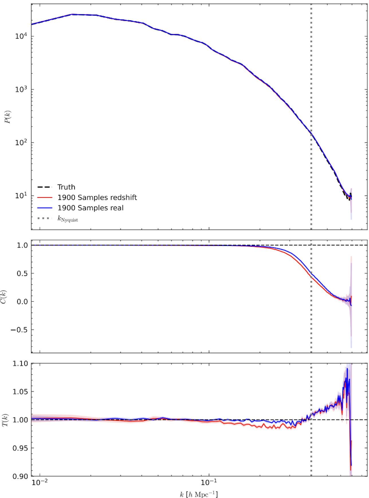

# IC_pixel-diffusion: Pixel-based Diffusion Model for Reconstructing Cosmological Initial Conditions

This project investigates the **ability of diffusion models to reconstruct cosmological initial conditions (ICs)** under different scenarios.  
We evaluate the model’s performance in the presence of **noisy observations** (halo fields), **varying numbers of training samples**, and by **adding additional observational information**, in order to study its robustness and reconstruction quality.

  

## Overview

The core architecture of this project is based on **“Posterior Sampling of the Initial Conditions of the Universe from Non-Linear Large-Scale Structures Using Score-Based Generative Models”**([arXiv:2304.03788](https://arxiv.org/abs/2304.03788)).
1. We first generate datasets from the Quijote Latin Hypercube simulations for both z = 127 (initial conditions) and z = 0 (dark-matter and halo fields).  
2. We then apply a pixel-based diffusion model to these observational datasets to evaluate reconstruction performance under different conditions. 
3. Finally, we assess the model’s accuracy using three key metrics: Power Spectrum, Cross-Correlation Coefficient, and Transfer Function.

## Dataset Preparation

<b>Details</b>

The dataset used for this project is based on the **Quijote simulation suite**, which provides large-scale N-body simulations of the Universe.  
These simulations are used here to generate both the initial condition density fields (z = 127) and the observational fields — including dark matter and halo density fields (z = 0).

You can access all Quijote simulation datasets through their official website:[https://quijote-simulations.readthedocs.io](https://quijote-simulations.readthedocs.io/en/latest/index.html#). After downloading the simulation data, use the generation scripts provided in this repository to produce the voxelized datasets.

- The **initial condition (z = 127)** density fields are generated using the Latin Hypercube simulation snapshots from Quijote.
  [Code](https://github.com/UVA-MLSys/IC_pixel-diffusion/blob/main/Dataset/generate_train_z127_density.py)

- The **dark matter density fields (z = 0)** are generated from the same Latin Hypercube snapshots.
  [Code](https://github.com/UVA-MLSys/IC_pixel-diffusion/blob/main/Dataset/generate_train_z0_density.py)

- The **halo density fields (z = 0)** are constructed from halo catalogs produced by the Friends-of-Friends (FoF) algorithm applied to the Quijote N-body simulations.
  [Code](https://github.com/UVA-MLSys/IC_pixel-diffusion/blob/main/Dataset/generate_halo_redshift_mass.py)

After generating the individual samples for both redshifts (z = 127 and z = 0), use the **stacking script** in the `Dataset/` folder to combine all simulation IDs into single large `.npy` arrays for training.

Depending on your training setup, you can choose how many samples to include based on simulation ID, and split the dataset between training and testing subsets accordingly. 

For demonstration purposes, three small stacked dataset samples are included in the `Dataset/` folder:

- `quijote128_halo_train_3.npy` — stacked sample of z = 0 halo density fields (3 simulations)  
- `quijote128_dm_train_3.npy` — stacked sample of z = 0 dark matter density fields (3 simulations)  
- `quijote128_z127_train_3.npy` — stacked sample of z = 127 initial condition fields (3 simulations)

These example files allow users to verify the dataset format and test the training and sampling scripts without downloading the full dataset.

The complete datasets (2000 generated samples for each redshift) are available on Google Drive: [Complete Generated Dataset](https://drive.google.com/drive/folders/1ZXA-cQ1ivpXbd2ran7DfiySZpYnfk1vc?usp=sharing)  

## Model Training

<b>Details</b>

The stacked datasets of both redshifts (**z = 0** dark matter/halo fields and **z = 127** initial condition fields) are fed into the conditional diffusion model for training.

We begin by training the model with 100 samples, gradually increasing the number up to the full training set (1900 samples) to examine the sensitivity of the model to training dataset size. Additionally, we incorporate the velocity field into the dark matter density field to analyze how the inclusion of extra physical information affects model performance. We also evaluate the model’s robustness using noisy observational data, such as redshift-space dark matter and halo density fields.

The corresponding training script is provided here:[Training Code](https://github.com/UVA-MLSys/IC_pixel-diffusion/blob/main/train.py)

Training is performed on **4 NVIDIA A100 GPUs** available on the **UVA Rivanna** supercomputing cluster,  
using a **batch size of 4 per GPU** (effective total batch size of 16) for **400 epochs**.  
The full training process with 1900 samples takes approximately **17 hours**.

All key hyperparameters—such as the number of epochs, batch size, learning rate, and model configuration—can be modified in the corresponding [configuration file](https://github.com/UVA-MLSys/IC_pixel-diffusion/blob/main/config.json) to adapt to different datasets or experiments.

## Sampling and Evaluation

 

<b>Details</b>

After training, the model enters the **sampling phase**, where it generates reconstructed initial conditions from unseen test data. During sampling, the model takes the observed z = 0 halo/DM field as input and progressively denoises it to reconstruct the corresponding z = 127 initial condition field.

The sampling process is executed using the following script:[`sample.py`](https://github.com/UVA-MLSys/IC_pixel-diffusion/blob/main/sample.py)

The number of generated samples can be adjusted as a hyperparameter in the configuration file.

Once sampling is complete, the generated outputs are combined into a single file using the stacking script:[`combine_samples.py`](https://github.com/UVA-MLSys/IC_pixel-diffusion/blob/main/Combine_sample.py)

This combined file is then used to evaluate the model’s reconstruction performance. Evaluation is carried out using: [`result.py`](https://github.com/UVA-MLSys/IC_pixel-diffusion/blob/main/results.py)

The evaluation script computes three primary metrics to quantify reconstruction accuracy:

- **Power Spectrum** — measures the statistical similarity of large-scale modes.  
- **Cross-Correlation Coefficient** — quantifies the phase alignment between reconstructed and true fields.  
- **Transfer Function** — evaluates the scale-dependent amplitude accuracy.

## Results

 

<b>Details</b>

This section presents the results of the experiments conducted under different training and observation conditions.

### Sensitivity to the Number of Training Samples
We first examine the sensitivity of the model to the number of training samples. The model was trained with 100, 500, 800, and 1900 samples, and its performance was evaluated using the three metrics: Power Spectrum, Cross-Correlation Coefficient, and Transfer Function.

As shown in the figure below, increasing the number of training samples primarily improves the Transfer Function, while P(k) and C(k) exhibit only little gains (e.g., *C(k)* increases slightly from 0.88 for 100 samples to 0.90 for 1900 samples).

<h4 align="center">Figure 1: Sensitivity to the number of training samples</h4>

  

### Effect of Adding the Velocity Field
Next, we investigate the effect of adding the velocity field as additional input information during training. This introduces six extra channels into the input dataset. The goal is to assess how this additional physical information influences reconstruction quality across the three metrics.

Adding the velocity field results in a slight improvement in the cross-correlation coefficient (*C(k)*), but at higher training sample sizes, it produces a negative impact on the transfer function, indicating potential over-conditioning or redundancy in the input features.

<h4 align="center">Figure 2: Effect of Adding the Velocity Field</h4>

  

### Effect of Noisy Observations
Finally, we test the model under noisy observational conditions. We condition the model on redshift-space dark matter fields and halo fields, both of which represent more realistic and noisier observations compared to ideal real-space dark matter fields.

As seen in the plots below, conditioning on noisier data degrades reconstruction accuracy—especially the cross-correlation coefficient (*C(k)*):  
- Using halo fields as observations reduces *C(k)* from 0.90 to 0.60.  
- Using redshift-space dark matter fields decreases *C(k)* from 0.90 to 0.87.  

These results show that as observation noise increases, model performance—particularly in *C(k)*—deteriorates more noticeably.

<h4 align="center">Figure 3: Effect of Noisy Observations (Halo and Redshift-Space)</h4>

  
  

